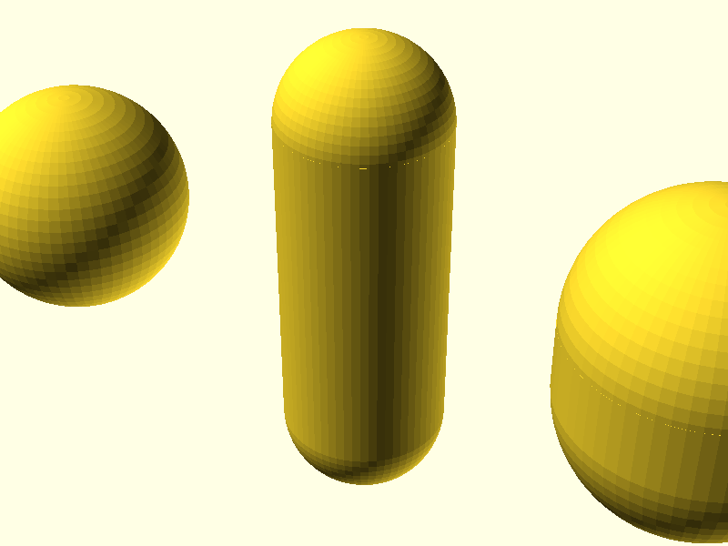
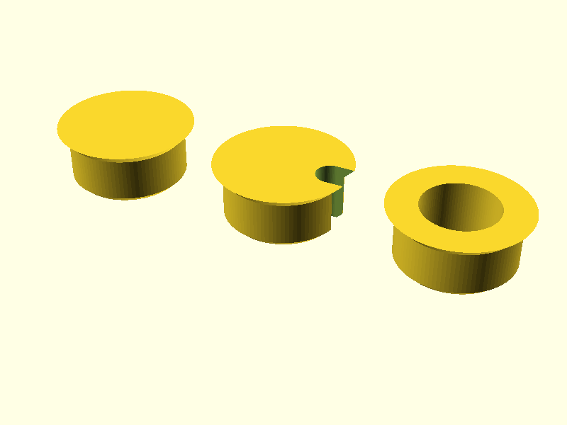

# OpenSCAD Interesting Shapes

Reusable OpenSCAD shape library. Pure OpenSCAD primitives -- no external dependencies.

## Usage

```scad
include <interesting_shapes.scad>

capsule(radius = 5, length = 30);
dog_hole_cap(cap_height = 1.76);
```

---

## Shapes

### `capsule(radius, length)`

Cylinder with hemispherical ends. Built from two spheres joined by a cylinder, all sharing the same radius.

| Parameter | Type | Description |
|-----------|------|-------------|
| `radius` | number | Radius of the capsule (spheres and cylinder) |
| `length` | number | Total end-to-end length (must be >= 2 * radius) |

When `length == 2 * radius`, the cylinder height is zero and the result is a sphere.



*Left: degenerate sphere (`radius=7, length=14`). Center: standard capsule (`radius=5, length=30`). Right: wide short capsule (`radius=8, length=20`).*

**Examples:**

```scad
include <interesting_shapes.scad>

// standard capsule
capsule(radius = 5, length = 30);

// wider, shorter
capsule(radius = 8, length = 20);

// degenerate -- pure sphere (length == 2 * radius)
capsule(radius = 7, length = 14);
```

See [`examples/capsule_example.scad`](examples/capsule_example.scad) for a runnable demo, or
**[▶ Open in SCAD Studio](https://lizard-spock.co.uk/openscad-gui/?github=morganp/openscad-interesting-shapes/examples/capsule_example.scad)** to view it in the browser, no install.

---

### `dog_hole_cap(dog_hole, dog_depth, cap_height, ...)`

Flush fitting cap for a 20mm bench dog hole in an MFT style worktop. The cap is a
45 degree cone that seats in the eased edge of the hole, not a disc resting on the
surface, so the top finishes flush and a workpiece slides over it.

| Parameter | Type | Default | Description |
|-----------|------|---------|-------------|
| `dog_hole` | number | 20 | Bore diameter |
| `dog_depth` | number | 10 | How far the plug body reaches into the bore |
| `cap_height` | number | 1.76 | Height of the seating cone. See below |
| `centre_hole` | bool | false | Bore the cap through on its axis |
| `centre_hole_diameter` | number | 13 | Diameter of that axial bore |
| `offset_hole` | bool | true | Cut a cable notch through the wall |
| `offset_hole_diameter` | number | 5 | Diameter of that notch |
| `base_chamfer` | number | 1 | Lead in at the far end of the plug body |



*Left: blanking cap (`offset_hole=false`). Centre: default, with the cable notch.
Right: bored through (`centre_hole=true`).*

#### Setting `cap_height` from your chamfer depth

`cap_height` is the one parameter that decides whether the cap sits flush, and it
is set from the hole, not from taste. The cone rises at 45 degrees off the bore
wall, so it fills an eased edge exactly `cap_height` deep and finishes
`2 * cap_height` wider than the bore at the face.

Measure the chamfer on your holes: the depth from the worktop surface down to
where the bore goes parallel. Set `cap_height` to that number.

| Chamfer depth | `cap_height` | Cap face diameter |
|---------------|--------------|-------------------|
| 0.5 | 0.5 | 21.00 |
| 1.0 | 1.0 | 22.00 |
| **1.76** | **1.76** | **23.52** |

- **`cap_height` smaller than the chamfer**: the cone never touches the taper, so
  the cap drops until the body binds, sitting low and loose.
- **`cap_height` larger than the chamfer**: the cone bottoms on the lip and the cap
  stands proud by the shortfall.

The default 1.76 is proven on a printed and fitted part in 20mm holes. It is also
one 0.2mm layer under 2mm, so printed cap face down the cone finishes on a clean
layer boundary.

`cap_height` doubles as the figure to subtract when budgeting total assembly
length: a cap seated in the chamfer adds nothing to the stack, one resting on the
surface adds `cap_height` at each face.

**Examples:**

```scad
include <interesting_shapes.scad>

// default, cable notch, 20mm hole with a 1.76mm chamfer
dog_hole_cap();

// plain blank
dog_hole_cap(offset_hole = false);

// lightly chamfered holes, measured at 1.0mm
dog_hole_cap(cap_height = 1.0);

// grommet, bored through the middle
dog_hole_cap(centre_hole = true, offset_hole = false);
```

See [`examples/dog_hole_cap_example.scad`](examples/dog_hole_cap_example.scad) for a
runnable demo, or
**[▶ Open in SCAD Studio](https://lizard-spock.co.uk/openscad-gui/?github=morganp/openscad-interesting-shapes/examples/dog_hole_cap_example.scad)** to view it in the browser, no install.

---

## File Structure

```
interesting_shapes.scad        -- library (include this in your projects)
examples/
  capsule_example.scad         -- runnable demo for capsule
  dog_hole_cap_example.scad    -- runnable demo for dog_hole_cap
images/
  capsule.png                  -- rendered preview
  dog_hole_cap.png             -- rendered preview
```

## Versioning

Releases follow [Semantic Versioning 2.0.0](https://semver.org).
